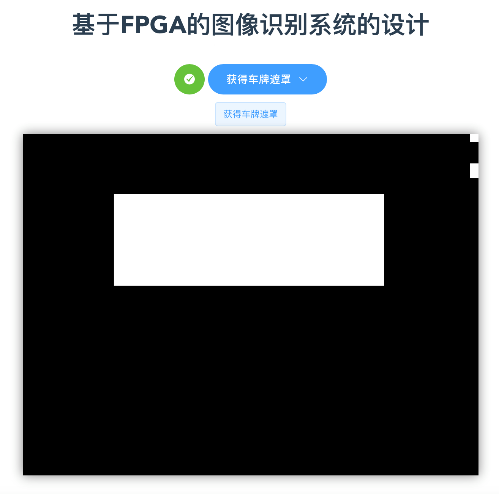

# Design of Image Recognition System Based on FPGA

If you think that developing FPGA must be use Verilog, be sure to close this page.Thank you.

## Hardware Architecture


## Hardware Devices

- DE1-SOC board
- Logic C270 UVC camera
- Raspberry Pi 3 B+
- SD Card 16GB+

## Software

- Quartus 18.1
- IntelFPGA OpenCL SDK 18.1
- ubuntu 16.04 root file system

## How to compile

1. Install Quartus 18.1
2. get this project file:
   ```
   git clone https://github.com/YanAndFish/de1-soc_license_plate
   ```
3. Install DE1-SOC BSP (de1soc_sharedonly_vga) in your Quartus installation directory
4. Open `Intel FPGA Embedded Command Shell` and make OpenCL file `.aocx`
   ```
   cd ./opencl_host/program
   make fpga
   ```
   You can find make's files in the Bin folder in the current directory.
5. Copy `opencl_host/program` in your SD Card Ubuntu file system
6. Copy `opencl_host/program/bin/YUYV2RGBHSV/top.rbf` in you SD Card boot partition and rename `opencl.rbf`
7. In DE1-SOC Ubuntu system,open the `Terminal` to make APP.
   ```
   cd opencl_host/program
   make host -j4
   ```
8. Build Vue. In Raspberry Pi:
   ```
   cd web
   npm install
   npm run build
   ```

## How to run

1. In Raspberry Pi, run Python Server:
    ```
    cd python
    python3 server.py&
    python3 relay.py&
    ```
2. In DE1-SOC board,run APP:
   ```
   cd opencl_host/program
   ./bin/run
   ```

## Screenshot





